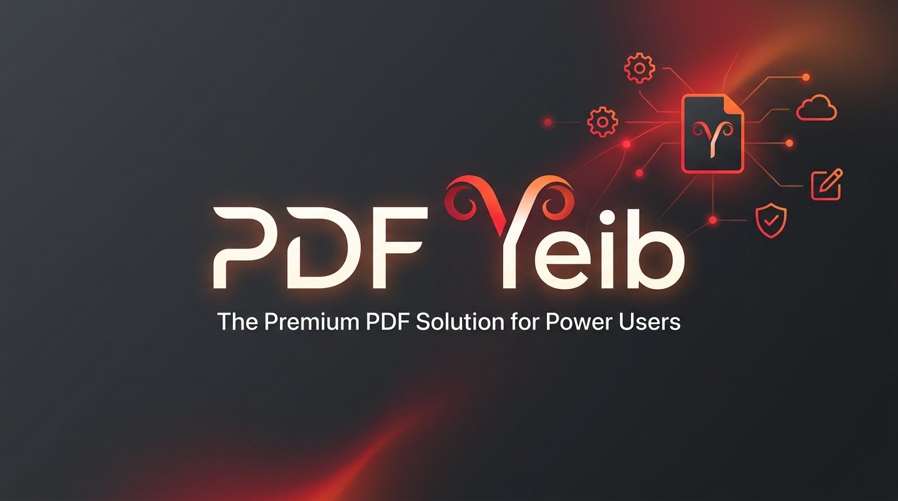

  
   
  <h1>PDF Yeib</h1>
  
<strong>Gestión, edición y conversión visual de documentos PDF 100% Offline y Privado.</strong>

  
  
  
  

 

**PDF Yeib** es una herramienta de escritorio ultraligera diseñada para resolver el caos del día a día con documentos e imágenes. Sin suscripciones en la nube, sin marcas de agua molestas y, lo más importante, **sin enviar tus documentos privados a servidores externos**. Todo ocurre en tu máquina.

## ✨ Características Principales

- 🛡️ **100% Privacidad Local:** El motor de renderizado y conversión funciona completamente sin conexión. Tus contratos, fotos y datos nunca abandonan tu computadora.
- 🗂️ **Fusión Universal (Drag & Drop):** Arrastra y suelta documentos PDF, imágenes (`.jpg`, `.png`, `.webp`, `.bmp`, `.gif`) y archivos de texto (`.txt`) en una sola interfaz visual.
- 📝 **Motor Inteligente de Texto a PDF:** Transforma archivos `.txt` planos en documentos PDF perfectamente formateados con saltos de página y márgenes automáticos.
- ✂️ **Estudio de Recorte Integrado:** Encuadra, haz zoom y recorta imágenes directamente dentro de la aplicación antes de exportar, con proporciones predefinidas (A4, Cuadrado, Libre, etc.).
- 📐 **Control de Formato:** Exporta tu trabajo final con precisión utilizando formatos estándar de la industria (A4, Carta, Legal) y control total sobre los márgenes.
- 🚀 **Rendimiento Nativo:** Construido sobre **Tauri OS** y Rust, ofreciendo un consumo mínimo de RAM y CPU en comparación con las apps tradicionales basadas en Electron.

## 🚀 Descarga e Instalación

1. Ve a la sección de [Releases](https://github.com/yeib/PDFyeib/releases) en este repositorio.
2. Descarga el último instalador `.exe` para Windows.
3. ¡Instala y comienza a arrastrar archivos!

*(Próximamente disponible en la Microsoft Store).*

## 🎯 ¿Para quién es esto?

Para el estudiante que necesita unir sus apuntes en fotos con PDFs del profesor. Para el profesional que maneja contratos confidenciales y no puede usar conversores web gratuitos. Para cualquiera que busque una herramienta rápida, estética y directa al grano.

## 🤝 Soporte y Contacto

Si tienes alguna idea genial o encuentras un bug, siéntete libre de abrir un **Issue** en este repositorio. ¡Estaré encantado de leerte!

---

  Hecho con ☕ y código por <a href="https://github.com/yeib">Yeib</a>.

