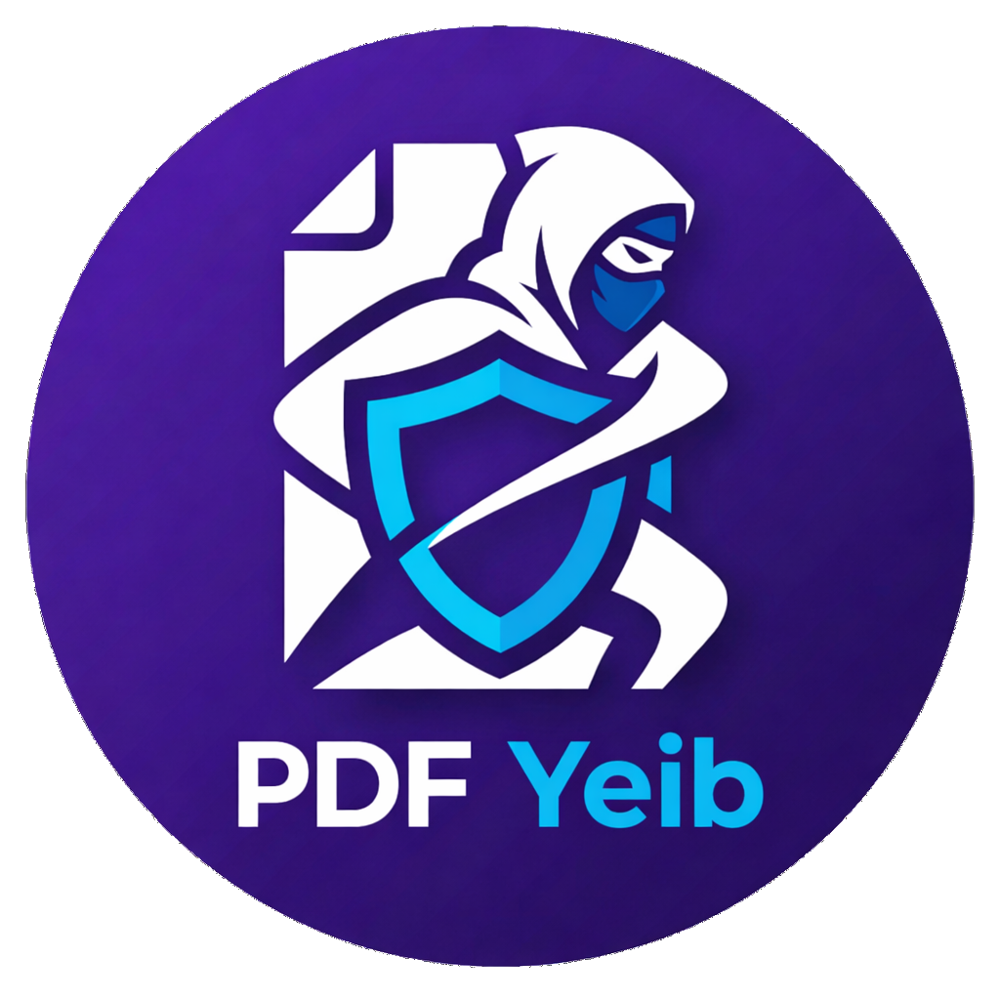

  
  <h1>PDF Yeib</h1>
  
    
  <strong>Gestión, edición y conversión visual de documentos PDF 100% Offline y Privado.</strong>
    
  
  
  
  

 

**PDF Yeib** es una herramienta de escritorio ultraligera diseñada para resolver el caos del día a día con documentos e imágenes. Sin suscripciones en la nube, sin marcas de agua molestas y, lo más importante, **sin enviar tus documentos privados a servidores externos**. Todo ocurre en tu máquina.

---

## Características Principales

- **100% Privacidad Local:** El motor de renderizado y conversión funciona completamente sin conexión. Tus contratos, fotos y datos nunca abandonan tu computadora.
- **Fusión Universal (Drag & Drop):** Arrastra y suelta documentos PDF, imágenes (`.jpg`, `.png`, `.webp`, `.bmp`, `.gif`) y archivos de texto o Markdown (`.txt`, `.md`) en una sola interfaz visual.
- **Desencriptado de PDFs en vivo:** Arrastra PDFs con contraseña y desbloquéalos en el momento ingresando la clave; PDF Yeib los re-empaquetará limpios y sin restricciones.
- **Modo Escáner (Mejora de Imagen):** Convierte instantáneamente fotos de documentos a blanco y negro con alto contraste para un acabado profesional que ahorra espacio.
- **Soporte de Markdown (.md):** Transforma archivos `.md` en documentos PDF perfectamente formateados (los títulos `#` y `##` se renderizan automáticamente en gran tamaño y negrita).
- **Tarjetas de Título y Separadores:** Genera rápidamente páginas de separación de texto "al vuelo" directamente en la aplicación sin necesitar programas externos.
- **Marcas de Agua y Numeración:** Estampa "CONFIDENCIAL" (u otro texto) en diagonal sobre tu PDF final e incluye numeración automática de páginas de forma nativa.
- **Estudio de Recorte Integrado:** Encuadra, haz zoom y recorta imágenes directamente dentro de la aplicación antes de exportar, con proporciones predefinidas.
- **Acciones Masivas:** Selecciona docenas de páginas con un solo clic para rotarlas o eliminarlas en grupo, agilizando el flujo de trabajo en archivos grandes.
- **Control de Formato:** Exporta tu trabajo final con precisión utilizando formatos estándar de la industria (A4, Carta, Legal) y control total sobre los márgenes.
- **Rendimiento Nativo:** Construido sobre **Tauri OS** y Rust, ofreciendo un consumo mínimo de RAM y CPU en comparación con las apps tradicionales basadas en Electron.

---

## Compra y Descarga

**Precio Oficial:** $4.99 USD *(Pago único de por vida. Cero suscripciones).*

> **¡Enlaces de compra próximamente! (Gumroad / Lemon Squeezy)**

*(Próximamente también disponible en la Microsoft Store).*

---

## ¿Para quién es esto?

Para el estudiante que necesita unir sus apuntes en fotos con PDFs del profesor. Para el profesional que maneja contratos confidenciales y no puede usar conversores web gratuitos. Para cualquiera que busque una herramienta rápida, estética y directa al grano.

---

## Soporte y Contacto

Si tienes alguna idea genial o encuentras un bug, siéntete libre de enviarme un correo. ¡Estaré encantado de leerte! yeib@pm.me
 

  Hecho con café y código por <a href="https://github.com/yeib">Yeib</a>.

